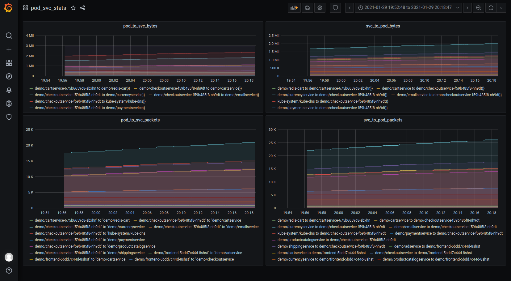
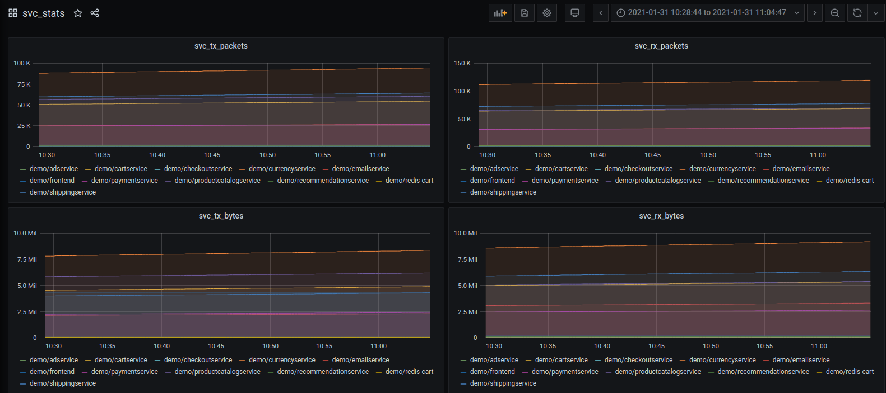
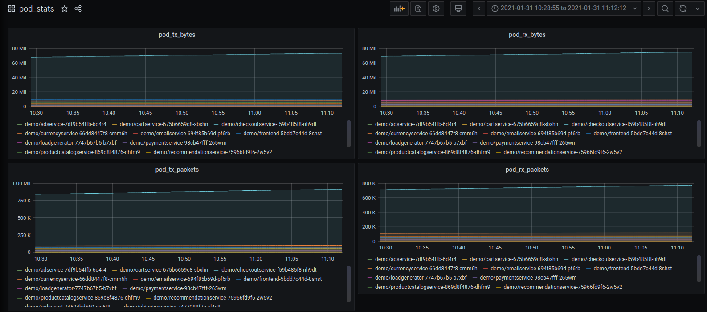

# statsagent

Kubernetes pod service stats with ebpf

## Prerequisites to build

docker 19.03

## Building

```
cd scripts
./build.sh
```

This will build the container with the required object files.
Go binary is called statsagent. Currently built container is named stalactite/statsagent:latest.

## Running

To get a daemonset in Kubernetes with the container, use the statsagent.yaml file in the scripts directory.
You can directly use the yaml file to try the latest image without building.

```
kubectl apply -f scripts/statsagent.yaml

```

### Kernel runtime dependencies

 [eBPF features by Linux version](https://github.com/iovisor/bcc/blob/master/docs/kernel-versions.md)

Has been tested on Linux 5.4. Ebpf cgroup attachment depends on linux kernel > 4.10.
By default cgroupv2 file system is mounted at /sys/fs/cgroup/unified. Default kubernetes installation
uses the cgroup heirarchy at /sys/fs/cgroup/unified/kubepods.slice. Right now these paths are hardcoded.
Additionally cgroupv1 net controllers cause issues with cgroupv2 attachment and these need to be disabled
with the boot option cgroup_no_v1=net_prio,net_cls.

### Kind

Boot option mentioned previously is also required for kind.
In the deployment file set CGROUP_ROOT to the cgroup root that docker uses for the specific kind node.
This is not easy to do manually and helm support needs to be added.
These steps only work for a single kind node deployment.
```
cd scripts
./deploy_kind.sh
```

### Vagrant

A vagrant VM with Ubuntu 20.10 and single node kind deployment with stats can be brought up by using the directory vagrant-kind.
Note that a reboot is necessary to apply the boot option
```
cd vagrant
vagrant up
vagrant ssh
sudo shutdown -r now
vagrant ssh
./run.sh
```

## Prometheus

Metrics are exported on the container port 8010 for now. Following metrics are available: 

| pod_svc_stats | Pod to service stats |
| ------------- | -------------------- |
| statsagent_pod_svc_stats_pod_to_svc_bytes | pod to service bytes |
| statsagent_pod_svc_stats_pod_to_svc_packets | pod to service packets |
| statsagent_pod_svc_stats_svc_to_pod_bytes | service to pod bytes |
| statsagent_pod_svc_stats_svc_to_pod_packets | service to pod packets |

| pod_stats | Pod stats |
| --------- | --------- |
| statsagent_pod_stats_pod_tx_bytes | pod egress bytes |
| statsagent_pod_stats_pod_tx_packets | pod egress packets |
| statsagent_pod_stats_pod_rx_bytes | pod ingress bytes |
| statsagent_pod_stats_pod_rx_packets | pod ingress packets |

| svc_stats | Service stats |
| --------- | ------------ |
| statsagent_svc_stats_svc_tx_bytes | service egress bytes | 
| statsagent_svc_stats_svc_tx_packets | service egress packets |
| statsagent_svc_stats_svc_rx_bytes | service ingress packets |
| statsagent_svc_stats_svc_rx_packets | service ingress packets |





